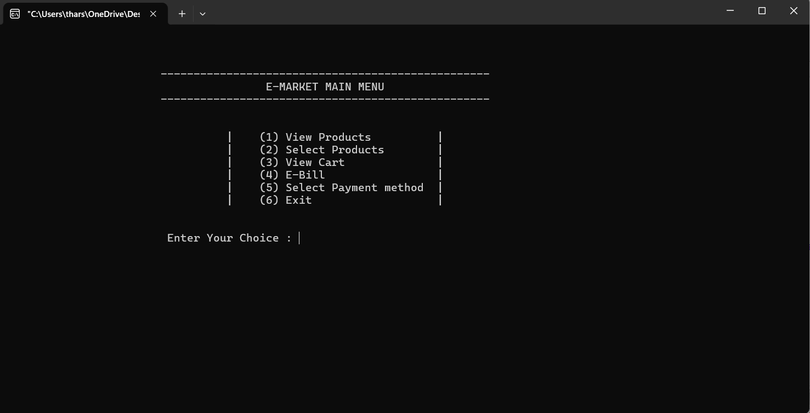
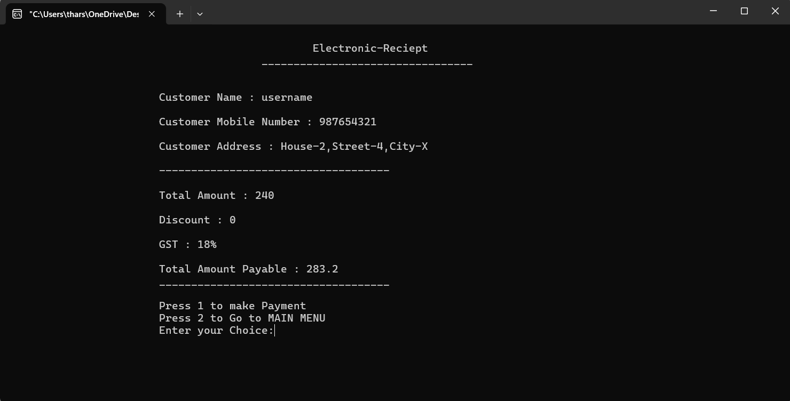

# **E-Market - Shopping Management System**  

## **Overview**  
This project is an interactive console-based shopping management system called **E-Market**. It allows users to create an account, log in, browse products, add items to a cart, apply discounts, generate bills, and process payments.  

## **Features**  
- **User Authentication**: Users can create an account and log in using stored credentials.  
- **Product Management**: Displays a categorized list of products with prices.  
- **Shopping Cart**: Users can add/remove items from the cart.  
- **Discounts**: Applies discounts based on purchase quantities and categories.  
- **Billing**: Generates an electronic receipt for purchases.  
- **Payment Options**: Offers Cash on Delivery and Debit Card payment methods.  

## **Installation and Usage**  

### **Prerequisites**  
- C++ Compiler (e.g., g++, clang++)  

### **Compilation**  
```sh
 g++ finalcode.cpp -o e_market
```  

### **Running the Program**  
```sh
 ./e_market
```  

## **Code Structure**  
- **`main()`**: Displays the main menu and manages user authentication.  
- **`create()`**: Allows users to create an account and stores credentials in a file.  
- **`login()`**: Authenticates users based on stored credentials.  
- **`menu()`**: Displays shopping options.  
- **`products()`**: Lists all available products.  
- **`select()`**: Allows users to select products for purchase.  
- **`cart_function()`**: Manages the shopping cart, including item additions and removals.  
- **`applyDiscounts()`**: Applies discounts based on quantity thresholds.  
- **`bill()`**: Generates and displays the final bill.  
- **`pay()`**: Provides payment options (Cash on Delivery or Debit Card).  
- **`DC` Class**: Manages debit card payments.  
- **`cartss` Class**: Handles cart operations and checkout.  

## **Algorithms Used**  
- **Merge Sort**: Used for sorting products by price in both ascending and descending order.  
- **Binary Search**: Could be implemented for efficient product lookup (not currently included but recommended for future improvements).  
- **Discount Calculation Algorithm**: Determines applicable discounts based on category and quantity thresholds.  
- **File Handling**: Manages user authentication by storing and retrieving credentials from a file (`records.txt`).  
- **Vector-based Data Management**: Uses C++ `vector` to store and manipulate product details dynamically.  

## **File Handling**  
- **User credentials**: Stored in `records.txt`.  
- **Billing information**: Stored in `Bill.txt`.  

## **Screenshots**  

### **Welcome Window**  
  

### **Create Account / Login**  
  

### **Main Menu**  
  

### **View Products**  
  

### **Select Products**  
  

### **Add to Cart**  
  

### **Continue Shopping or Checkout**  
  

### **Checkout**  
  

## **Future Enhancements**  
- Implementing a GUI for better user interaction.  
- Adding an admin panel for product and order management.  
- Integrating an online payment gateway.
- Integration of Backend.
- Strong AUthentication system implementation


